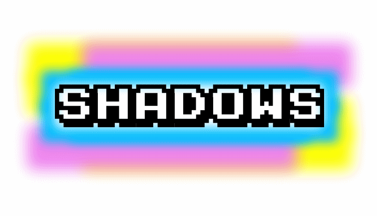
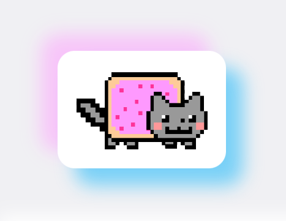
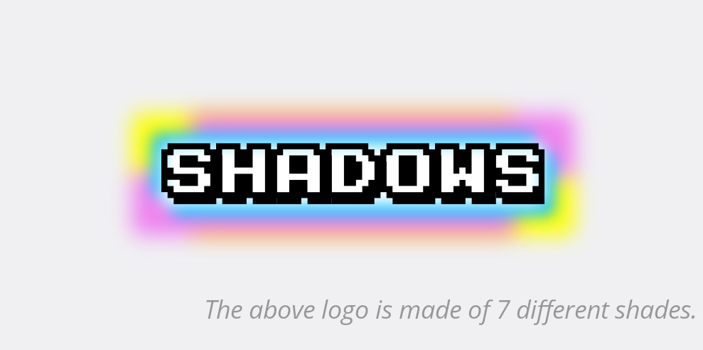
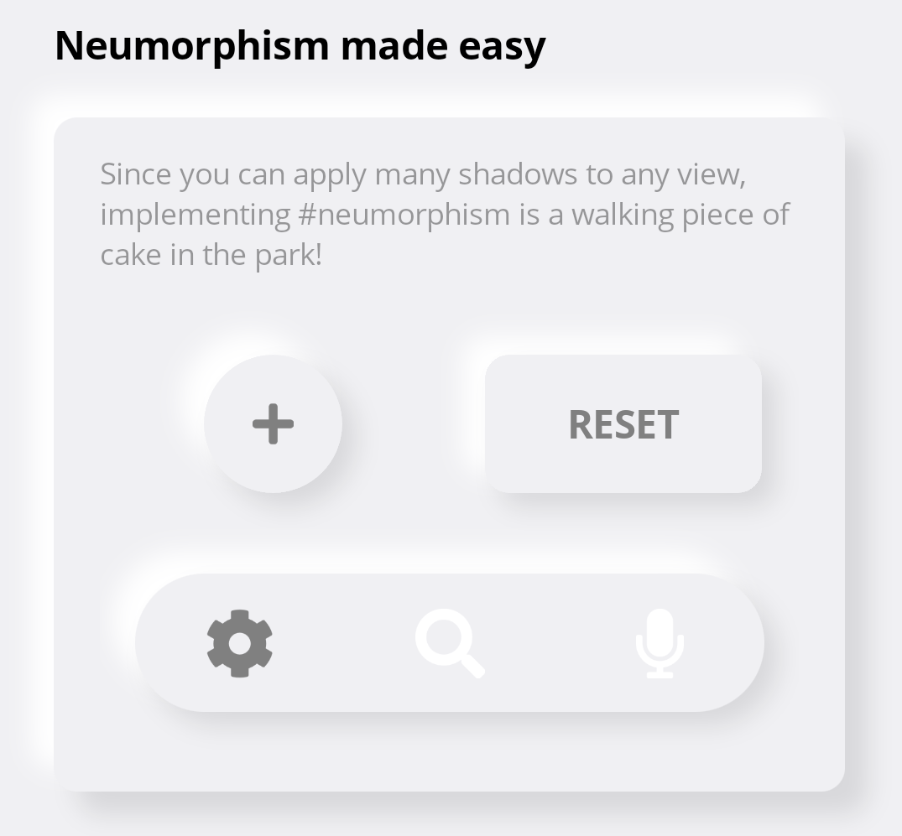
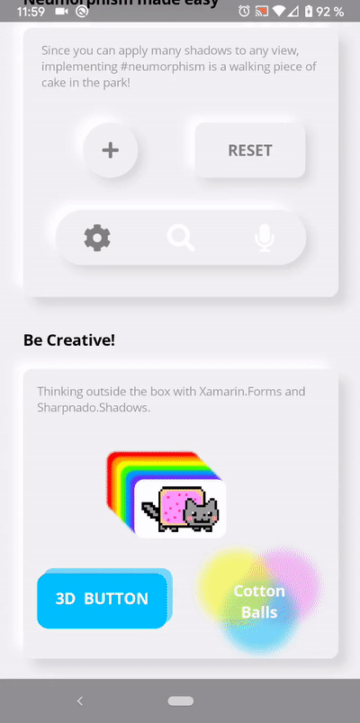

# Sharpnado.Shadows

<p align="left">

Get it from NuGet:

[](https://www.nuget.org/packages/Sharpnado.Shadows)

| Supported platforms        |
|----------------------------|
| :heavy_check_mark: Android |
| :heavy_check_mark: iOS     |
| :heavy_check_mark: UWP     |
| :heavy_check_mark: Tizen   |


## Initialization

* On Core project in `App.xaml.cs`:

For the namespace schema to work, you need to call initializer from App.xaml.cs like this:

```csharp
public App()
{
    InitializeComponent();

    Sharpnado.Shades.Initializer.Initialize(loggerEnable: false);
    ...
}
```

* On `iOS` add this line after `Xamarin.Forms.Forms.Init()` and before `LoadApplication(new App())`.

`Sharpnado.Shades.iOS.iOSShadowsRenderer.Initialize();`

* On `UWP`, you must register the renderers assembly like this, before `Xamarin.Forms.Forms.Init()`:

`var rendererAssemblies = new[] { typeof(UWPShadowsRenderer).GetTypeInfo().Assembly }; `

* On `Tizen` add this line after `Xamarin.Forms.Forms.Init()` and before `LoadApplication(new App())`.

`Sharpnado.Shades.Tizen.TizenShadowsRenderer.Initialize();`

## Presentation

Add as **many** **custom** shadows as you like to any `Xamarin.Forms` view (`Android`, `iOS`, `UWP`, `Tizen`).

* You can specify each shadow `Color`, `Opacity`, `BlurRadius`, and `Offset`
* Simply implement `Neumorphism`
* You can add one shadow, 3 shadows, 99 shadows, to any `Xamarin.Forms` element
* Animate any of these property and make the shadows dance around your elements
*  No `AndroidX` or `SkiaSharp` dependency required (except Tizen), only `Xamarin.Forms`

## Shadows for Xamarin.Forms components creators

`Shadows` has been developed with modularity in mind, making it really easy to integrate into your own components.

Read the wiki doc: https://github.com/roubachof/Sharpnado.Shadows/wiki/Shadows-for-Xamarin.Forms-components-builders.

## Using Shadows

`Shadows` is a container for any `Xamarin.Forms` view. 
Just wrap your view in it and start adding shadows:

**XAML**

```xml
<sh:Shadows x:Name="CatShadows"
            CornerRadius="10">
    <sh:Shadows.Shades>
        <sh:ImmutableShades>
            <sh:Shade BlurRadius="10"
                      Opacity="0.5"
                      Offset="-10,-10"
                      Color="#FE99FE" />
            <sh:Shade BlurRadius="10"
                      Opacity="0.5"
                      Offset="10,10"
                      Color="#00B0FB" />
        </sh:ImmutableShades>
    </sh:Shadows.Shades>
    <Frame WidthRequest="80"
           Padding="10"
           HorizontalOptions="Center"
           VerticalOptions="Center"
           BackgroundColor="White"
           CornerRadius="10">
        <Image Source="{images:ImageResource nyan_cat.png}" />
    </Frame>
</sh:Shadows>
```

**OUTPUT**



Thanks to the `CornerRadius` property you can match your target corner to achieve a perfect shadow.
For example, you can add a shadow to a rounded button:

**XAML**

```xml
<sh:Shadows CornerRadius="30"
            Shades="{sh:SingleShade Offset='0, 10',
                                    Opacity=0.7,
                                    Color=Violet}">
    <ImageButton WidthRequest="60"
                 HeightRequest="60"
                 Padding="20"
                 HorizontalOptions="Center"
                 VerticalOptions="Center"
                 BackgroundColor="Violet"
                 CornerRadius="30"
                 Source="{StaticResource IconPlusWhite}" />
</sh:Shadows>
```

**OUTPUT**


### Choose your Shade Collection

You can use several type of `IEnumerable<Shade>`:

#### 1. ReadOnlyCollection<Shade>

This is what you want to use most of the time.
All the different `IMarkupExtension` like `ImmutableShades, NeumorphismShades, SingleShade`, return a `ReadOnlyCollection<Shade>`.
If you use a `ReadOnlyCollection<Shade>`, all shades will be cloned to be sure the immutability is respected.
It means, you can specify shades as static objects in your `ResourceDictionary`, it won't create any leak or view hierarchy issues.

```xml
<ResourceDictionary xmlns="http://xamarin.com/schemas/2014/forms"
                    xmlns:x="http://schemas.microsoft.com/winfx/2009/xaml"
                    xmlns:sh="clr-namespace:Sharpnado.Shades;assembly=Sharpnado.Shadows">
    <sh:SingleShade x:Key="ShadowTop"
                    BlurRadius="6"
                    Opacity="0.15"
                    Offset="0,-8"
                    Color="{StaticResource ShadowsColor}" />

    <sh:SingleShade x:Key="ShadowBottom"
                    BlurRadius="6"
                    Opacity="0.1"
                    Offset="0,5"
                    Color="{StaticResource ShadowsColor}" />

    <sh:SingleShade x:Key="ShadowAccentBottom"
                    BlurRadius="6"
                    Opacity="0.4"
                    Offset="0,4"
                    Color="{StaticResource AccentColor}" />

    <sh:ImmutableShades x:Key="ShadowNone" />

    <sh:NeumorphismShades x:Key="ShadowNeumorphism" />

    <sh:NeumorphismShades x:Key="ShadowThinNeumorphism"
                          LowerOffset="8, 6"
                          UpperOffset="-8,-6" />
</ResourceDictionary>
```

#### 2. ObservableCollection<Shade>

Only if you want to dynamically add or remove shade during the view lifetime.

#### 3. All other IEnumerable<Shade>

If you want to modify a shade property during the view lifetime.

**IMPORTANT**: if you don't use a `ReadOnlyCollection<Shade>` please be sure to declare your `Shade` as transient. 
It means you should declare a new instance of `Shade` for each `Shadows` views. For example, in code-behind with `new Shade()`, or in xaml with `Shades` property. 
Just don't reference static instances of shade from `ResourceDictionary` with `StaticResource` references, or even in a C# class.

### Shades

The `Shadows` component has only 2 properties:

1. `int CornerRadius` which should be equal to the component's child view `CornerRadius` to achieve a good shadow effect,
2. `IEnumerable<Shade> Shades` which is the enumeration of all the shades this shadow is made of.

A shade is what you could call a "sub-shadow". 

Each shade has 4 properties:

1. `Point Offset`: the offset of the shade
2. `Color Color`: the color of the shade
3. `double Opacity`: the opacity of the shade
4. `double BlurRadius`: the amount of blur your want for this shade

**Logo.xaml**

```xml
<?xml version="1.0" encoding="UTF-8" ?>
<sh:Shadows x:Class="ShadowsSample.Views.Logo"
            xmlns="http://xamarin.com/schemas/2014/forms"
            xmlns:sh="http://sharpnado.com/schemas/shadows"
            CornerRadius="3">
    <sh:Shadows.Shades>
        <sh:ImmutableShades>
            <sh:Shade BlurRadius="10"
                      Opacity="1"
                      Offset="-15,-15"
                      Color="Yellow" />
            <sh:Shade BlurRadius="10"
                      Opacity="1"
                      Offset="15,15"
                      Color="Yellow" />
            <sh:Shade BlurRadius="10"
                      Opacity="1"
                      Offset="-15,15"
                      Color="Violet" />
            <sh:Shade BlurRadius="10"
                      Opacity="1"
                      Offset="15,-15"
                      Color="Violet" />
            <sh:Shade BlurRadius="5"
                      Opacity="1"
                      Offset="-5,-5"
                      Color="DeepSkyBlue" />
            <sh:Shade BlurRadius="5"
                      Opacity="1"
                      Offset="5,5"
                      Color="DeepSkyBlue" />
            <sh:Shade BlurRadius="5"
                      Opacity="1"
                      Offset="0,0"
                      Color="White" />
        </sh:ImmutableShades>
    </sh:Shadows.Shades>
    <Label Style="{StaticResource TextHuge}"
           VerticalOptions="Center"
           FontFamily="{StaticResource FontKarmatic}"
           Text="Shadows" />
</sh:Shadows>
```

**OUTPUT**



### Neumorphism

To have a nice `Neumorphism` effect we need to choose a background color.
I found that `#F0F0F3` was quite good, so I will stick to it for our content **and** our page background color.

Since `Neumorphism` implementation is made of 2 shadows, one bright at the top left, one dark at the bottom right, achieving a `Neumorphism` style with `Shadows` for all the views is really easy:

```xml
<Style ApplyToDerivedTypes="True" TargetType="sh:Shadows">
    <Setter Property="CornerRadius" Value="10" />
    <Setter Property="Shades">
        <sh:ImmutableShades>
            <sh:Shade BlurRadius="10"
                      Opacity="1"
                      Offset="-10,-10"
                      Color="White" />
            <sh:Shade BlurRadius="10"
                      Opacity="1"
                      Offset="6, 6"
                      Color="#19000000" />
        </sh:ImmutableShades>
    </Setter>
</Style>
```

If you want to add `Neumorphism` to specific elements a `NeumorphismShades` markup extension will help you with that:

**XAML**

```xml
<sh:Shadows Grid.Row="1"
            Grid.Column="0"
            CornerRadius="40"
            Shades="{sh:NeumorphismShades}">
    <ImageButton WidthRequest="60"
                 HeightRequest="60"
                 Padding="20"
                 HorizontalOptions="Center"
                 VerticalOptions="Center"
                 BackgroundColor="#F0F0F3"
                 CornerRadius="30"
                 Source="{StaticResource IconPlusGray}" />
</sh:Shadows>

<sh:Shadows Grid.Row="1"
            Grid.Column="1"
            CornerRadius="10"
            Shades="{sh:NeumorphismShades}">
    <Button Style="{StaticResource TextHeadline}"
            WidthRequest="120"
            HeightRequest="60"
            HorizontalOptions="Center"
            VerticalOptions="Center"
            BackgroundColor="#F0F0F3"
            CornerRadius="10"
            Text="Reset"
            TextColor="Gray" />
</sh:Shadows>
```

**OUTPUT**



### Be creative!

One last thing: all properties of a `Shade` are animatable.

You can achieve nice effects thinking outside the box!
Have a look at the `BeCreative.xaml` file and its code-behind.




### Immutable and mutable collections of shades

To have a better control of your shades, `Shadows` provides 2 kinds of `MarkupExtension`:

1. One immutable collection of shades: `ImmutableShades` (readonly type)
2. One mutable collection: `ShadeStack` (observable collection type)

Use the first one if the shade collection will not change and the second one if you want to dynamically add or remove shades.

*Dynamic shades starting with 0 shade.*
```xml
<sh:Shadows CornerRadius="10">
    <sh:Shadows.Shades>
        <sh:ShadeStack />
    </sh:Shadows.Shades>
    <Frame WidthRequest="80"
           Padding="10"
           HorizontalOptions="Center"
           VerticalOptions="Center"
           BackgroundColor="White"
           CornerRadius="10">
        <Image Source="{images:ImageResource nyan_cat.png}" />
    </Frame>
</sh:Shadows>
```

#### SingleShade

You can also use the `SingleShade` markup extension if you just have one shadow.
It will remove some xaml elements:

```xml
<sh:Shadows CornerRadius="30"
            Shades="{sh:SingleShade Offset='0, 10',
                                    Opacity=0.7,
                                    Color=Violet}">
    <ImageButton WidthRequest="60"
                 HeightRequest="60"
                 Padding="20"
                 HorizontalOptions="Center"
                 VerticalOptions="Center"
                 BackgroundColor="Violet"
                 CornerRadius="30"
                 Source="{StaticResource IconPlusWhite}" />
</sh:Shadows>
```

## Performance

* On `Android`, shadows are created thanks to `RenderScript`. Bitmaps are cached in a global `BitmapCache`. For a particular color, size and blur, you will only have one instance alive.
* On `iOS`, a `Shade` is implemented with a simple `CALayer`
* On `UWP`, `Shade` is implemented with `SpriteVisual` drop shadows.
* On `Tizen`, `Shade` is implemented with `SkiaSharp`.
